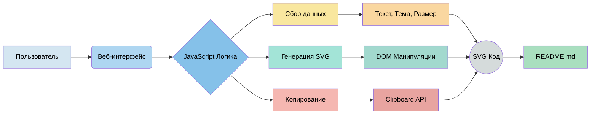

# GitHub Profile Card Maker

Простой конструктор SVG-карточек для профилей GitHub и GitVerse.

**🔗 Демо:** https://gitverse-custom-card-site.vercel.app  
**📦 Исходный код:** https://github.com/Pepega-Commander/gitverse-custom-card-site

## Возможности
- Генерация SVG-карточки с вашим текстом (заголовок и описание)
- Выбор цветовой темы
- Настройка размера шрифта
- Мгновенное копирование готового SVG-кода

## Как использовать
1. Откройте [демо-сайт](https://gitverse-custom-card-site.vercel.app)
2. Введите заголовок и описание
3. Выберите тему
4. Нажмите «Скопировать SVG-код»
5. Вставьте код в `README.md` вашего профильного репозитория

## Пример использования
После создания карточки добавьте в `README.md` вашего профильного репозитория (например, `crystalfire/crystalfire`):
```

```

## Технологии

- **Frontend**: Vanilla JavaScript (ES6+), HTML5, CSS3
- **SVG Generation**: Native DOM API для создания и управления векторной графикой
- **Hosting & Deployment**: Vercel (автоматический деплой из ветки `main`)
- **Version Control**: Git, GitHub/GitVerse
- **Code Quality**: Ручное тестирование, валидация кода

---

*Проект создан в рамках учебного курса «Современные инструменты разработки»*

## 🏗️ Архитектура проекта


*Диаграмма показывает поток данных от пользователя до готового SVG-кода.*

**Ключевые компоненты:**
1.  **`index.html`** — Статический интерфейс с полями ввода и preview-областью.
2.  **`script.js`** — Детерминированная логика (**Software 1.0**):
    *   Слушает события полей ввода (`input`, `change`)
    *   Собирает данные (текст, тему, размер шрифта)
    *   Генерирует SVG через `document.createElementNS()`
    *   Управляет копированием в буфер обмена
3.  **`style.css`** — Стили интерфейса и CSS-классы для тем карточек.
4.  **SVG Output** — Чистый векторный код, готовый для вставки в любой `README.md`.

**Поток данных:** Пользовательский ввод → Обработка в JavaScript → Генерация SVG DOM → Визуализация → Экспорт кода.
